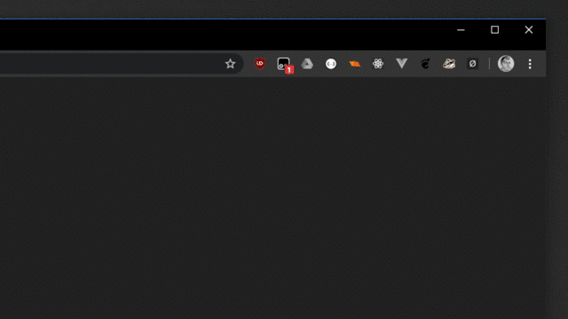
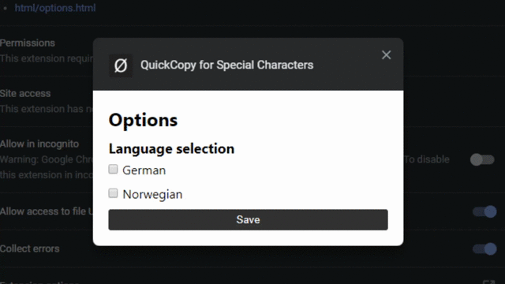

# QuickCopy Extension

A chrome extension that lets you quickly copy any of the language specific characters to your clipboard. 

This extension was made for people who don't want to add an additional language to their keyboards and still want a quick and easy way to access those special characters without using an external source.

## All Available Languages

| Language | Country Code | Special Characters |
| --- | --- | --- |
| German | de | ß, ä, ö, ü, Ä, Ö, Ü |
| Norwegian | no | ø, æ, å, Ø, Æ, Å |

## Language Selection

Use the options page to customize your language selection.

